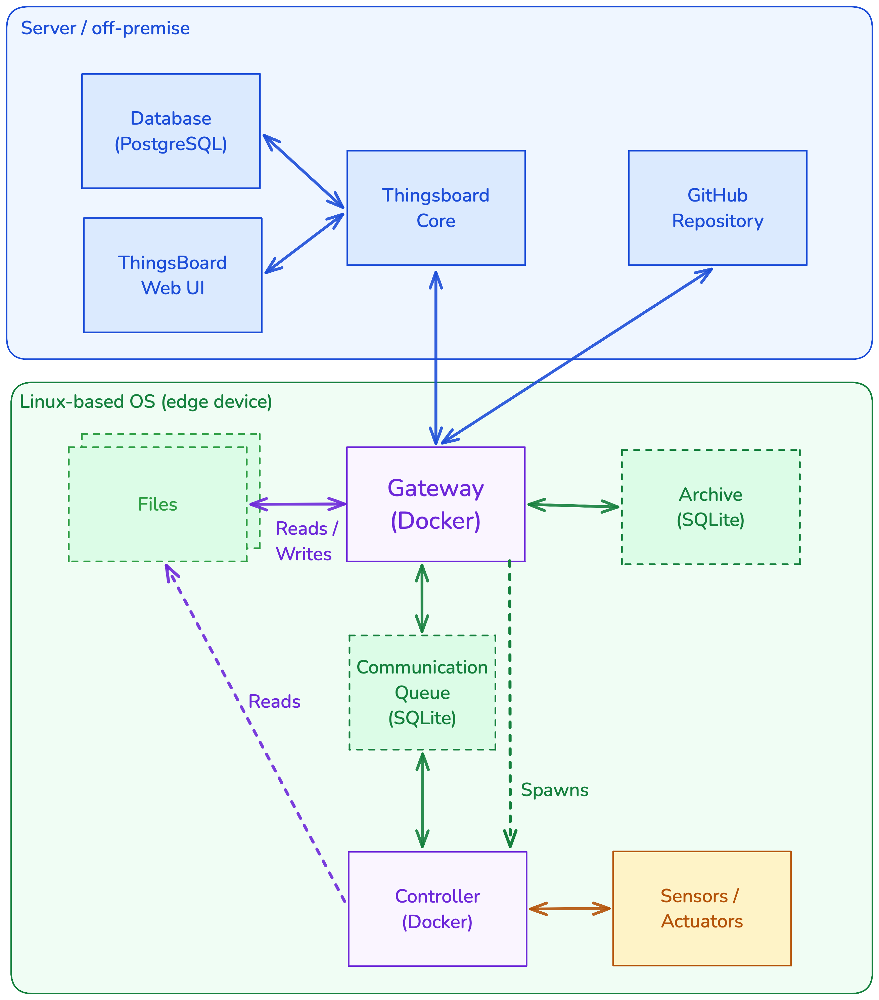

Data Flows
==========

Several data flows involve the TEG-Gateway as the central component:

1. **Device Data Flow**

   Data collected by the Controller via sensors/actuators/logs is provided to the TEG-gateway via an sqlite database.
   This database serves as a buffer between data generated by the controller and message forwarding to ThingsBoard by
   the gateway. The independent database also ensures data persistence in case of power outages or bugs/crashes.

2. **ThingsBoard Data Flow**

    The TEG-Gateway both receives and sends data to/from the ThingsBoard server via MQTT. Received MQTT messages include
    RPC commands, OTA Software update version information as well as file definitions/content via shared ThingsBoard
    attributes. The TEG-gateway publishes all messages received from the controller to ThingsBoard via this MQTT channel,
    along with its own log messages / metadata.
    MQTT is also used for device provisioning during initial setup.

3. **Git repository Data Flow (OTA Updates)**

    To perform over-the-air (OTA) software updates on the controller, the TEG-gateway fetches commits in a local git
    repository from the configured git remote server. Once fetched, the commits/tags are searched for a match with the
    desired version and the corresponding commit is checked out locally and used for building a new controller Docker image.
    Updates are triggered and managed through the ThingsBoard Web UI.

   See :ref:`remote-software-updates` for details.

4. **Local file read/write data flow**

    The TEG-Gateway enables remote file management on its host device's local file system. Using ThingsBoard Shared Attributes
    users can define files to be either read-only or read/write, as well as what content should be written to them.

   See :ref:`remote-file-management` for details.
